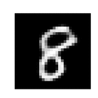
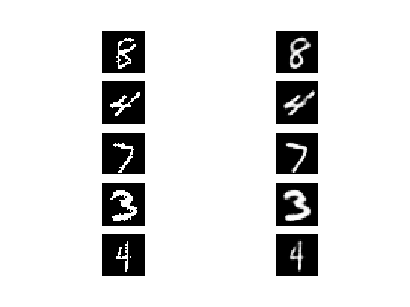
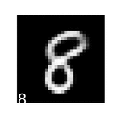
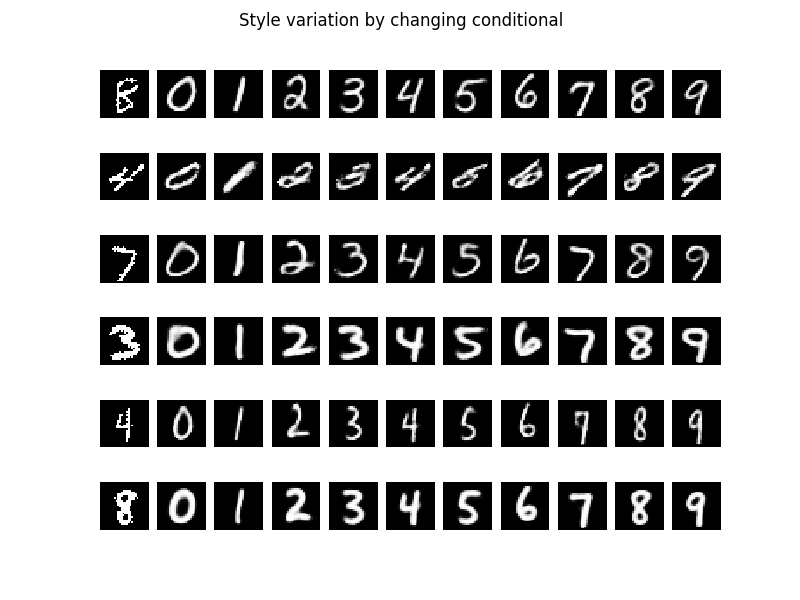
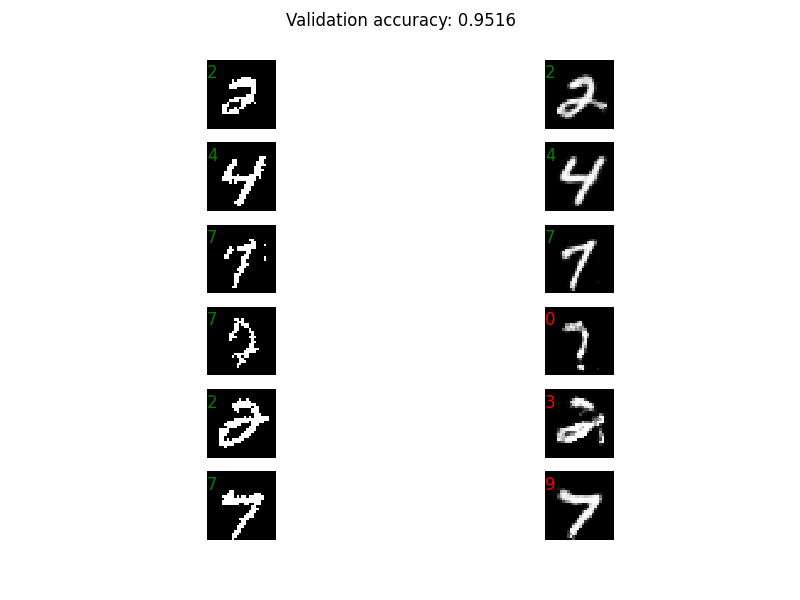

PDF version of slides included.
Slides also uploaded to https://speakerdeck.com/kastnerkyle

Video of talk here:
https://www.youtube.com/watch?v=TBBtOeY2Q78

To run the code in the graphics directory, you will need Theano.
I have not run this on CPU yet, but it runs pretty quickly on GPU.
To run the code, simply go to ``graphics_code/vae`` or ``graphics_code/cvae``

``THEANO_FLAGS="floatX=float32,device=gpu,mode=FAST_RUN" python vae.py``

or

``THEANO_FLAGS="floatX=float32,device=gpu,mode=FAST_RUN" python cvae.py``

will start training the model. After training,

``THEANO_FLAGS="floatX=float32,device=gpu,mode=FAST_RUN" python flying_vae.py serialized_vae.pkl``

or

``THEANO_FLAGS="floatX=float32,device=gpu,mode=FAST_RUN" python flying_cvae.py serialized_cvae.pkl``

will generate plots for the saved model.

Variational Autoencoder
=======================

This variational autoencoder follows the general procedure described in
[Auto-Encoding Variational Bayes, Kingma and Welling](http://arxiv.org/abs/1312.6114)

Another paper describes a similar concept, [Stochastic Backpropagation and Approximate Inference in Deep Generative Models, Rezende, Mohamed, and Wierstra](http://arxiv.org/abs/1401.4082).

VAE Code Walking
================

Conditional VAE Reconstruction
==============================

Conditional Variational Autoencoder
===================================
This conditional variational autoencoder follows a similar procedure to that described in
[Semi-supervised Learning with Deep Generative Models, Kingma, Rezende, Mohamed, and Welling](http://arxiv.org/abs/1406.5298).

Conditional VAE Code Walking With Conditional Control
=================================

Holding Style (Z) Fixed and Changing Conditional y 
==================================================

Conditional VAE Reconstruction and Prediction
=============================================

Linked content
==============
sklearn-theano, a scikit-learn compatible library for using pretrained networks http://sklearn-theano.github.io/

My research code https://github.com/kastnerkyle/santa_barbaria

Neural network tutorial by @NewMu / Alec Radford https://github.com/Newmu/Theano-Tutorials

Theano Deep Learning Tutorials http://deeplearning.net/tutorial/
